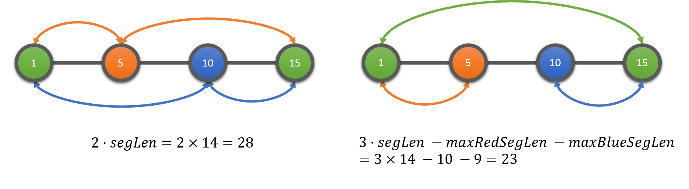

**太耻辱了**！！！

Educational Round 42 中的 E 题就是这道题，然而本辣鸡看一眼就往 MST 去想了。补题的时候偷懒不写题解，那补题还有什么意义？浪费时间？自我安慰？亡羊补牢为时未晚，现在把这道题的题解补上。

# 题面

一条数轴上有 $n \ (1 \le n \le 300000)$ 个点，每个点都有一种颜色：红 $R$、 绿 $G$、 蓝 $B$ 中的一种。

Roy 和 Biv 想用一些边把这些点连起来。任意两点间都可以连一条边，而连边的长度即两端间的距离。他们希望能使所有点之间联通。

然而，Roy 不能看见红色的点，而 Biv 不能看见蓝色的点。因此，他们希望最终的结果在两人看来都是联通的（即，若删去所有的红点剩余点之间仍然联通，同时若删去所有蓝点剩余点之间仍然联通）。

试求最小边长度之和。

[题目链接](http://codeforces.com/contest/908/problem/F)

# 贪心！

首先我们不妨对题目进行一些观察：

- 在 $R$ 点 和 $B$ 点间连线是很不划算的，因为两人都看不到；
- 对于形如 $R \ G \ R$ 的序列，直接连接两个 $R$ 并不划算。我们完全可以将两个 $R$ 与中间的 $G$ 连起来，这样的话边长之和实际上等于直接连接两个 $R$，而且还多拖了一个 $G$ 进来（对于形如 $B \ G \ B$ 的序列也是同理的）。这样一来，我们完全就可以以中间的 $G$ 为分界线分开考虑左右两个区间了。

这样一分析后解决方法就显而易见了。我们可以将原序列以 $G$ 为界分割成若干个小序列。我们记小序列的长度为两端 $G$ 点间的距离：$\text{segLen}$。对于任意一个小序列，我们有两种可能的连接方式：

- 两端的 $G$ 不直接相连，分别联通两端 $G$ 之间的所有 $R$ 点 和 $B$ 点，再将最左和最右的 $R$ 点 和 $B$ 点分别与左端 $G$ 和 右端 $G$ 相连。这样一来，这个小序列连边的总长度为 $2 \cdot \text{segLen}$。
- 两端的 $G$ 直接相连，这样一来我们就可以不必连接两端 $G$ 之间相距最远的两个 $R$ 点（最接近端点的 $R$ 点与端点 $G$ 的边也包含在内），同理对于 $B$ 点也一样。这样一来，这个小序列的长度为：$3 \cdot \text{segLen} - \text{maxRedSegLen} - \text{maxBlueSegLen}$。

我们以样例一为例直观地阐述一下两种连接方式：

我们只需要对于每个小序列算出上述两个值，取较小者加起来就好了。

另外，我们需要单独注意一下没有 $G$ 点的情况。

# 参考代码

[Submission #33805058](http://codeforces.com/contest/908/submission/33805058)

[GitHub Backup Link](https://github.com/codgician/ACM-ICPC/blob/master/Codeforces/908F/greedy.cpp)
