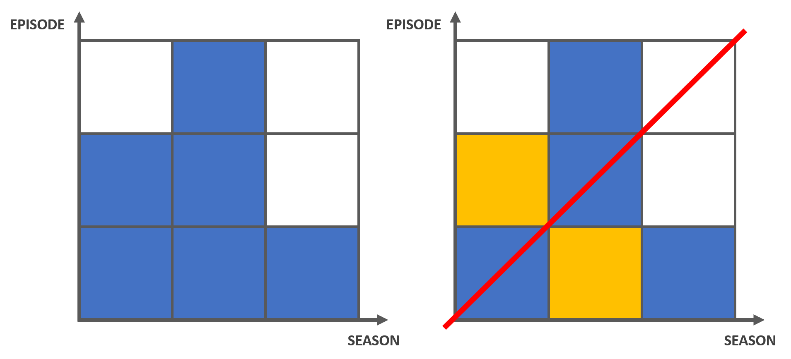

# 题面

Polycarp 决定二刷他最喜欢的电视剧 Tufurama，但是当他搜索这个电视剧的时候发现如果第 $i$ 季第 $j$ 集和第 $j$ 季第 $i$ 集同时存在的话他可能搜索到错误的结果（$i \neq j$）。已知该电视剧一共有 $n \ (1 \leq n \leq 2 \cdot 10^5)$ 季，第 $i$ 季有 $a_i \ (1 \leq a_i \leq 10^9)$ 集，试问有多少对 $(i, j)$ 会导致错误结果的出现。

注：$(i, j)$ 和 $(j, i)$ 视作一对。

[题目链接](http://codeforces.com/problemset/problem/961/E)


# 转化

我们不妨对问题做一些转化以使得问题简单些。

首先，我们不难发现，既然季的数量都是小于等于 $2 \cdot 10^5$ 的，那么如果集数超过 $2 \cdot 10^5$ 的话自然是找不到相应季数与之混淆的。因此我们不妨把集数超过 $2 \cdot 10^5$ 的季的集数都记作 $2 \cdot 10^5$。

于是我们可以考虑一个由 $1 \times 1$ 方格组成的一个 $n \times n$ 的正方形。其中横轴代表季数，纵轴代表集数。而我们要找到答案，事实上就是关于对角线 $y = x$ 对称的点对个数。

举一个样例来直观阐述这个模型：

样例：

```
3
2 5 1
```

转化：

对于集数为 $5$ 的第 $2$ 季，我们可以记其集数为 $3$。



很显然，这个样例的答案为 $1$，因为只存在一对： $(1, 2)$。


# 暴力

我们依然按照上面的样例去思考，让我们想想暴力怎么做。

当我们关注第 $i$ 列时，与第 $i$ 列关于对角线对称的自然是第 $i$ 行（均为自下往上数，后文中不再注释）。我们不难发现列上面的有色方格必然是连续的，而行上面的点有可能是离散的。那么自然，而有效的 $(i, j)$ 对的个数无非就是第 $j$ 行前 $i$ 个点中有色方格的个数。最后，我们需要去除所有 $i = j$ 的点对并且将结果除以 $2$ 以去重。

例如，对于上面的样例，我们如下计算：

- $i = 1$ 时，看第 $1$ 行前 $a_1 = 2$ 个方格中有色方格的个数：$2$。去除 $(1, 1)$ 后方格数为 $1$；
- $i = 2$ 时，看第 $2$ 行前 $a_2 = 3$ 个方格中有色方格的个数：$2$。去除 $(2, 2)$ 后方格数为 $1$；
- $i = 3$ 时，看第 $3$ 行前 $a_3 = 1$ 个方格中有色方格的个数：$0$。

那么最后的答案就是 $\frac{1}{2} \times (1 + 1) = 1$ 咯。


# 优化

我们不难发现，暴力中其实在对第 $i$ 列进行求解的时候都需要求第 $i$ 行前 $a_i$ 个元素中有色方格的个数，说白了就是要求前缀和。那么我们显然可以用**树状数组**来优化这一过程。

显然树状数组中存储的是在某一行中第 $i$ 列上的方格是否为有色方格（无色为 $0$， 有色为 $1$），这样前缀和就是有色方格的个数了。

但是我们显然不可能开 $2 \cdot 10^5$ 个树状数组来维护每一行。我们注意到只有在处理第 $i$ 行的时候第 $i$ 列才会被用到，其余时候都不会被用到，于是我们思考是否可以只开一个树状数组来维护这一过程：在初始的时候，树状数组表示第 $1$ 行中有色方格的情况。当第 $i$ 行查询完后，我们对树状数组中的元素进行更新使得其变为第 $i + 1$ 行的情况，然后我们再查询……

至于怎么更新…… 我们只需要在查询第 $i$ 行前删除所有 $a_j < i$ 的 $j$ 列（在树状数组中将其变为 $0$）就可以了。为了使这个过程更高效，我们可以另外开一个结构体数组 $b$ 来存放每一季的下标与集数，然后对其按集数从小到大排序。然后在查询第 $i$ 行前一直按结构体数组 $b$ 中顺序删除集数小于 $i$ 的第 $j$ 季即可。

我们再以之前提到的样例为例子演示一边过程。

- 首先，树状数组中将每一季都初始化为 $1$，以表示第 $1$ 行的状态；
- 另外开一个结构体数组 $b$ 记录每一季的下标 $\text{id}$ 与集数 $\text{epiNum}$，将其按照集数 $\text{epiNum}$ 从小到大排序；
- $i = 1$ 时，求得树状数组中前 $a_i = 2$ 个元素的前缀和：$2$，去除 $(1, 1)$ 后个数为 $1$；
- $i = 2$ 时，先更新树状数组，按照 $b$ 中数组中顺序在树状数组中删除第 $b_k.\text{id}$ 季直到 $b_k.\text{epiNum} \geq i$，该过程中被删除的只有第 $3$ 列。接着，求得树状数组中前 $a_i = 3$ 个元素的前缀和：$2$，去除 $(2, 2)$ 后个数为 $1$；
- $i = 3$ 时，先更新树状数组，按照 $b$ 中数组中顺序在树状数组中删除第 $b_k.\text{id}$ 季直到 $b_k.\text{epiNum} \geq i$，该过程中被删除的只有第 $1$ 列。接着，求得树状数组中前 $a_i = 1$ 个元素的前缀和：$0$。

最终的答案就是 $\frac{1}{2} \times (1 + 1) = 1$ 。


# 参考代码

[完整参考代码](https://github.com/codgician/ACM-ICPC/blob/master/Codeforces/961E/binary_indexed_tree.cpp)


# %%%

- Vovuh - [Educational Codeforces Round 41 Tutorial](http://codeforces.com/blog/entry/58743)

