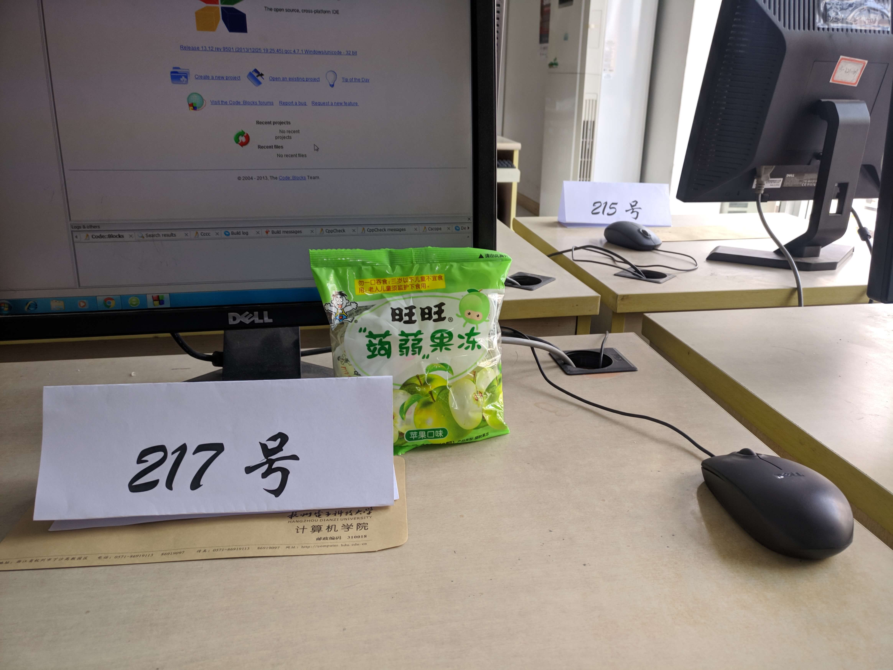
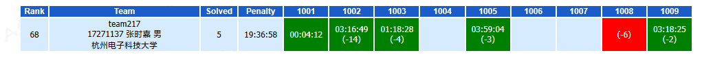

# 前言

2017 新生赛真是大爆炸啊，~~还差点被小学生吊打~~……

可能是我在比赛的时候带错了零食吧（以后再也不做这个死了），在吃了几块 **“蒟蒻果冻”** 后果然彻彻底底地显示出了本人的蒟蒻本色（呸说得好像你不吃蒟蒻果冻就不是蒟蒻一样）。



不管怎么说，通过这次比赛暴露出的问题的确引人深思。我决定认真总结本次比赛的题目，写下人生中的一篇解题报告（惭愧……）。


# 1001 - 考研

## 题面

### 题目描述

今天参加比赛的同学，我想以后准备考研的一定有不少。

以河北某高校为例，一共要考4门，分别是：数学（满分150）、英语（满分100）、政治（满分100）、专业课（满分150）。

不过，你知道考研分数线的这个特点吗——不仅总分要过分数线，单科也必须过线！

假设某年度该校研究生录取的分数线是这样的：数学和专业课单科分数线是85（含），英语和政治单科分数线是55（含），总分分数线是305（含）。并且规定——在单科和总分均过线的前提下，总分370分（含）以上的是公费生，否则是自费生。

现在告诉你一些考生的分数，你能判断他们的录取情况吗？

### 输入格式

输入数据第一行是一个正整数 $C$（$C \le 100$），表示有 $C$ 组测试用例。

接下来 $C$ 行，每行 4 个整数，分别表示一位考生的数学、英语、政治和专业课成绩。

### 输出格式

如果考生满足公费条件，请输出 A；
如果考生满足自费条件，请输出 B；
如果考生没有上线，请输出 C。

每组数据输出一行。

### 样例输入

```text
3
100 80 85 120
90 60 65 110
140 50 75 135
```

### 样例输出

```text
A
B
C
```


## 解题报告

签到题中的签到题，做不出来还参加什么竞赛（逃

[参考代码 - 1001](https://github.com/codgician/ACM-ICPC/blob/master/Contests/HDU/Freshman%20Cup%202017/1001.cpp)


# 1002 - 身份证

## 题面

### 题目描述

大学时代的小Q，是一个志向远大的热血青年，欲致力于国家网络建设。长年泡在电脑密集的地区潜心钻研以互联网为传输媒介，以个人计算机为终端，旨在实现休闲、交流、获得虚拟成就的多人在线游戏。

毕业后，小Q实现了自己的梦想，成功当上了一名光荣的网管。

众所周知，进网吧是要刷身份证的，现在老板让他写一个程序，判断进来的人是否够18周岁（当天恰好是18岁生日也可），并且根据身份证最后一位来校验身份证真伪。

身份证号码共有 18 位，从左至右编号，第 7 至第 14 位为生日，格式为 YYYYMMDD，代表年月日。最有一位为校验位，计算规则如下：

1. 将前面的身份证号码17位数分别乘以不同的系数。从第 1 位到第 17 位的系数分别为：7, 9, 10, 5, 8, 4, 2, 1, 6, 3, 7, 9, 10, 5, 8, 4, 2。
2. 将这 17 位数字和系数相乘的结果相加。
3. 用得到的结果除以 11，余数为 0 ~ 10 时对应的最后一位为：1, 0, X, 9, 8, 7, 6, 5, 4, 3, 2。

请判断给定的身份证号，如果号码合法且持有人年满18输出 “Accepted”，否则输出 “Sorry”（均不含引号）。

### 输入格式

输入包含多组测试数据。

每组输入数据第一行是一个正整数 $n$（$n \le 1000$）；

第二行 3 个 "-" 号隔开的正整数 YYYY-MM-DD，代表今天的日期；

接下来 $n$ 行每行一组身份证编码，每组编码 18 位。

### 输出格式

每组数据输出 $n$ 行，每行为 “Accepted” 或 “Sorry”（不含引号）。

### 样例输入

```text
3
2033-02-18
281289202506052608
696815200904169385
980189199511146901
```

### 样例输出

```text
Sorry
Accepted
Sorry
```

### 样例说明
第一个人不满18岁，第三个人身份证号不合法。


## 解题报告

这道题其实就是一个很简单很简单的模拟题，而且恰好在八月份的时候我还曾心血来潮研究过身份证校验码一番（虽然很可耻地烂尾了），但是我在那里面也给出了校验码的具体算法（[戳这里](/2017/09/01/learning-more-about-id-card-number/)）。所以看到题目的那一瞬间我那个兴奋啊…… 兴奋地把输入格式都看错了:sob: 呜呜呜呜呜。然后，就因为这个，这道题我 WA 了整整 14 次，在这 14 次 WA 间，我怀疑了整整 `1 << 14` 次人生，连出生日期的合法性（甚至连闰年 2 月有 29 天）都考虑进去了（事实上测试数据并没有这么强），导致在这到水题上我浪费了两个多小时…… 我太菜了。

**以后我再也不输入格式都不看清楚就直接跑去看样例了，呜呜呜呜呜……**

[参考代码 - 1002](https://github.com/codgician/ACM-ICPC/blob/master/Contests/HDU/Freshman%20Cup%202017/1002.cpp)


# 1003 - 下起楼来我最快

## 题面

### 题目描述

王尼玛是一名机智的程序员，他的机智主要表现在他下楼的速度特别快( > c < )。
王尼玛的家住在第 $n$ 层，他可以选择从电梯下楼或者走楼梯下楼。
当前电梯停在第 $m$ 层，如果他从电梯下到第1层，需要：电梯先到达这一层 -> 开门 -> 关门 -> 电梯再到达第一层 -> 开门（最后的开门时间也要计算在内）。

现在告诉你——
王尼玛的家在楼层 $n$，当前电梯停在的楼层 $m$，
以及电梯每经过一层楼的时间 $t_1$，开门时间 $t_2$，关门时间 $t_3$，还有王尼玛每下一层楼的时间 $t_4$。

请你帮王尼玛计算一下，他最快到达第 1 层的时间。

### 输入格式

输入包含多组测试用例，每组数据占两行——

第一行两个整数 $n$，$m$，其中 $n$ 表示王尼玛家在的楼层，$m$ 表示当前电梯停在的楼层；

第二行四个整数，$t_1$，$t_2$，$t_3$，$t_4$，其中 $t_1$ 表示电梯每经过一层楼的时间，$t_2$ 表示开门时间，$t_3$ 表示关门时间，$t_4$ 表示王尼玛每下一层楼的时间。

数据保证——
$1 \le n, m \le 100000$
$1 \le t_1,t_2,t_3,t_4 \le 100000$

### 输出格式

每组数据输出一行，含有一个时间，表示王尼玛最快到达第 1 层的时间。

### 样例输入

```text
5 10
1 5 5 4
5 10
1 1 1 4
```

### 样例输出

```text
16
12
```


## 解题报告

咳咳……从这道题开始我要严肃一点了……

首先，有一个常识问题，你不可以在第 $n$ 层的时候按个按钮让它滚到第 $m$ 层去，这样当你走楼梯到第 $m$ 层的时候就刚好可以坐电梯了（捂脸）。

所以这道题就十分简单了（我竟然一读完题就想到了上面那种啊情况，然后觉得题好难啊在那上面浪费了二十多分钟，呜呜呜呜呜）。

我们不妨把这个问题分成如下几种情况考虑：

**a. 当王尼玛家的楼层小于等于电梯所在楼层时（即 $n \le m$）**，有如下两种选择：

1. 走楼梯下去；
2. 乘电梯下去。

**b. 当王尼玛家的楼层大于电梯所在楼层时（即 $n > m$）**，有如下三种选择：

1. 走楼梯下去；
2. 直接在家的楼层乘电梯下去；
3. 走楼梯到电梯所在的楼层再坐电梯下去。

把上述所有情况所花的时间都算出来，取最小值就是最终的答案啦。

[参考代码 - 1003](https://github.com/codgician/ACM-ICPC/blob/master/Contests/HDU/Freshman%20Cup%202017/1003.cpp)


# 1004 - 正品的概率

## 题面

### 题目描述

袋中有 $m$ 枚正品硬币，$n$ 枚次品硬币（次品硬币两面都有国徽），在袋中任取一枚，将它投掷 $k$ 次，已知每次得到的都是国徽，那么这枚硬币是正品的概率是多少？

### 输入格式

输入包含多组数据，每组占一行包含 3 个正整数 $m$, $n$, $k$ （$1 \le m, n, k \le 50$）。

### 输出格式

每组输出一行，包含一个最简分数，硬币为正品的概率。

### 样例输入

```text
1 1 1
```

### 样例输出

```text
1/3
```


## 解题报告

这是一道数学题啊…… 可惜我不会。听大佬说这道题要用到**贝叶斯公式**：
$$
P(A|B) = \frac{P(B|A)P(A)}{P(B)}
$$

首先我们对公式本身进行一个简单的解释：

- $A$ 、$B$ 是两个事件，并且 $P(B) \neq 0$；
- $P(A|B)$ 是指：在事件 $B$ 发生的条件下 $A$ 发生的概率；
- $P(B|A)$ 是指：在事件 $A$ 发生的条件下 $B$ 发生的概率；
- $P(A)$ 和 $P(B)$ 是指**单独研究** $A$ 和 $B$ 时 $A$ 和 $B$ 发生的概率。


嗯…… 虽然我也并没有完全理解这个公式，但是有了这个公式就可以做题了（逃

令 $A =$ 任取一枚硬币，硬币是正品；$B =$ 任取一枚硬币，将硬币抛掷 $k$ 次，每次得到的都是国徽。

那么，很显然，题目所求的概率，就是在 $B$【任取一枚硬币，将硬币抛掷 $k$ 次，每次看到的都是国徽】的条件下，$A$【硬币是正品】的概率。也就是 $P(A|B)$。

因此我们很容易根据公式得出：
$$
P(A|B) = \frac{P(B|A)P(A)}{P(B)}
$$

$P(B|A)$，也就是在 $A$【任取一枚硬币，硬币是正品】 的条件下，$B$【将硬币抛掷 $k$ 次，每次得到的都是国徽】的概率。很容易可以得出 $P(B|A) = (\frac{1}{2}) ^ k$。

$P(A)$，也就是 $A$ 【任取一枚硬币，硬币是正品】独立发生的概率。很明显，$P(A) = \frac{m}{m + n}$。

对于 $P(B)$，我们就需要讨论一番了：

- 对于真币，$P(B|A) = (\frac{1}{2})^{k}$ ；
- 对于假币，$P(B|\overline{A}) = 1$。

*注：$\overline{A}$ 是指事件 $A$ 的相反事件。*

所以 $P(B) = P(A)P(B|A) + P(\overline{A})P(B|\overline{A}) = \frac{m}{m + n} \cdot (\frac{1}{2})^k + \frac{n}{m + n}$。

我们将刚刚求出来的值代入公式：
$$
P(A|B) = \frac{(\frac{1}{2})^k \cdot \frac{m}{m + n}}{\frac{m}{m + n} \cdot (\frac{1}{2})^k + \frac{n}{m + n}}
$$
化简后，得：
$$
P(A|B) = \frac{m}{m + n \cdot 2^k}
$$

好啦，公式推出来后我们就可以写程序了。但是在写程序的过程中，要注意以下问题：

- $1 \le m, n, k \le 50$，所以运算过程中可能出现 $2^{50}$，要用 `long long int`；
- 别忘了最后要化为最简分数（对分子分母求最大公约数除上即可）。

[参考代码 - 1004](https://github.com/codgician/ACM-ICPC/blob/master/Contests/HDU/Freshman%20Cup%202017/1004.cpp)


# 1005 - 整数的 Alvin 值

## 题面

### 题目描述

Alvin 在理解了一个数的二进制表达之后，认为二进制的每一位都拥有不同的权值，而一个数的权值是二进制为 1 的权值之和。

比如，假设我们分别认为二进制的前三位的权值为1、4、7，则对于 7 来说，其权值为 1 + 4 + 7 = 12，对于 6 来说其权值为 4 + 7 = 11。

但是 alvin 并不满足于这么简单的计算，现在，他定义了一个 alvin 值——
对于一个整数 $n$，alvin 值即为 1 到 $2 ^ n$ 的权值之和。

现在 alvin 给你一个整数 $n$，你能告诉他对应的 alvin 值吗？

### 输入格式

有多组数据输入。

每组数据有两行，第一行有一个整数 $n$，代表 alvin 所给的整数 $n$。

第二行有 $n + 1$个数，其中第 $i$ 个数 $a_i$ 代表第 $i$ 位所对应的权值。

数据规模：
$a_i \le 100, n \le 100$

### 输出格式

对于每组数据，输出一个数，代表 $n$ 的 alvin 值。
因为答案可能很大，所以**你只需要输出答案 mod (1e9 + 7) 的结果就好**。

### 样例输入

```text
2
1 1 1
2
1 1 0
```

### 样例输出

```text
5
4
```

### 样例提示
对于第一组样例：

- 0 的权值为 0；
- 1 的权值为 1；
- 2 的权值为 1；
- 3 的权值为 2；
- 4 的权值为 1，故权值之和为 5。


## 解题报告

在最后一分钟才 A 掉这道题，说来也是惊心动魄……

这个题嘛，如果你不找找规律，尽想暴力模拟，肯定是要 TLE 滴。

首先我们要解决的第一个问题是，对于一个整数 $n$ 究竟需要多少个权值？我们很容易得出， $2^n$ 的二进制位数有 $n + 1$ 位，自然也就需要 $n + 1$ 个权值。

接着，我们不妨先试着写写 0 ~ 4 的二进制吧：

- `0 0 0`
- `0 0 1`
- `0 1 0`
- `0 1 1`
- `1 0 0`

我们会发现，在二进制个位上 `0` 和 `1` 交替出现；在二进制十位上 两个 `0` 和 两个 `1` 交替出现。如果继续写下去，你会发现二进制百位上 四个 `0`  和 四个 `1` 交替出现；二进制千位上 八个 `0` 和 八个 `1` 交替出现…… 也就说，对于 $0 \sim 2^n - 1$ 间的所有数，从后往前数前 $n$ 位都是一半 `0` 一半 `1`，所以每一位的权值都会被加 $2 ^n / 2 = 2^{n - 1}$ 次。所以 $0 \sim 2^n - 1$ 的权值和就是（$a[i]$ 为权值数组）：

$$
\sum_{i = 1}^{n} a[i] \cdot 2^{n - 1}
$$

然后最后我们再加上 $2^n$ 的权值（即 $1 \cdot a[n + 1]$）就得出答案了。因此，正整数 $n$ 的 avlin 值 $A$ 为：

$$
A = \sum_{i = 1}^{n} a[i] \cdot 2^{n - 1} + a[n + 1]
$$

然后就可以愉快地写程序了，只是一定要注意随时取模（%）防止运算时溢出（即向对待神犇一样对待运算过程，逃……

[参考代码 - 1005](https://github.com/codgician/ACM-ICPC/blob/master/Contests/HDU/Freshman%20Cup%202017/1005.cpp)


# 1006 - 稿件整理 

## 题面

### 题目描述

面对每天敲代码找 Bug 的日子，小Q实在受够了，他决定放弃现在的 IT 技术岗位，追随自己的内心，重拾儿时的文学梦。

于是，他应聘到《中国梦月报》当了一名编辑。

一天，小Q和他的小伙伴们在核对刊物初稿，但是一位编辑不小心把稿件弄乱了—— 编辑可能将正反面弄反了，也可能将前后张打乱了！

稿件每面有一个页码，页码 1 总为正面，总页数 $n$ 总为偶数。现在，假设只能通过正反面的翻转与前后张的交换来整理稿件，并且正反面的翻转与前后张的交换都算作一次整理。

给出当前的页码顺序，请问最少经过几次整理，才能将稿件的页码恢复升序？

特别说明：在一次操作中，前后页交换时不可以同时翻转奇偶面。

### 输入格式

输入包含多组测试用例。

每组数据第一行输入总页数 $n$ ($1 \le n \le 100000$)，接下去的一行输入 $n$ 个数 ($1 \sim n$)，表示当前的页码顺序。

每两组输入之间有一空行。

### 输出格式

每组输出占一行，输出一个整数，表示需要的最少整理次数。

### 样例输入

```text
4
3 4 2 1

2
1 2
```

### 样例输出

```text
2
0
```


## 解题报告

这道题，其实就是一道求**逆序数**的题。

首先，题目说了 $n$ 一定是偶数，所以就不用再考虑奇数的情况啦。我们不妨将一张稿件定义成一个结构体，里面含有两个变量，分别代表正面页码和反面页码。

我们先来处理反面朝上的稿件。在输入的时候，如果发现正面页码大于反面页码，那么就说明这张纸反了，需要翻过来。此时交换一下两个成员的值并将整理次数 + 1。

接着，我们再来处理稿件顺序的问题。很明显，需要整理的次数就是这个结构体数组的逆序数。当然，看看这道题的数据规模就知道不能用冒泡排序等复杂度为 $O(n^2)$ 的算法来计算逆序数 —— 会 TLE 的。我们可以考虑采用归并排序来计算逆序数。问题就解决了。

*%%% mlj 大佬，我竟然归并排序都没想到，呜呜呜呜呜……*

[参考代码 - 1006](https://github.com/codgician/ACM-ICPC/blob/master/Contests/HDU/Freshman%20Cup%202017/1006.cpp)


# 1007 - 找方块

## 题面

### 题目描述

小明最近看到一件艺术品，是由许多黑白方块组成的矩形图，但是并不是黑白相间的。小明希望找到一个最大的黑白相间的矩形。

### 输入格式

第一行输入 $T$ （$T \le 10$）。
接下来输入 $T$ 组数据，每组数据第一行为 $N$，表示这个艺术品的矩阵大小是 $N \times N$（$N \le 100$）。
接下来是一个 $N \times N$ 的矩阵，0 代表黑色，1 代表白色。

### 输出格式

对于每组数据，输出最大的黑白相间矩形的面积。
每组输出占一行。

### 样例输入

```text
1
2
0 1
1 0
```

### 样例输出

```text
4
```


## 解题报告

这个题的大致意思就是找最大 0-1 相间的矩形。这种题好像跟之前做过的某种题有点像…… 对，没错，就是**寻找最大全 1 矩阵**（比如 [HDUOJ - 1505](http://acm.hdu.edu.cn/showproblem.php?pid=1505)）。

那我们现在的唯一的问题就是如何把这道题**转换为求最大全 1 矩阵**。

我们发现，对于 0-1 相间的矩阵，所有*行数 $i$* 和 *列数 $j$* 之和同奇偶位置上的元素一定是一样的；不奇偶则是不一样的。比如，对于样例中的那个 0-1 矩阵，$i + j$ 为偶数的位置上都是 0， $i  + j$ 为奇数的位置上都是 1。

显然，如果我们想把任意 0-1 矩阵转换为全 0 或者 全 1 矩阵，只需要对所有 $i + j$ 为奇数（或为偶数）的位置全部取反即可。而如果我们对任意矩阵进行上述操作，就会发现矩阵中含有的所有 0-1 相间矩阵均变成了 全 0 或 全 1 矩阵；与此同时，原矩阵中所含有的 全 0 和 全 1 矩阵也都变成了 0-1 相间矩阵。此时，我们只需求出变换后矩阵中 全 0 和 全 1 矩阵中的最大面积即可。

所以，解出这道题的思路就很清晰了。首先，在输入的过程中就对 $i + j$ 为奇数（或偶数）的所有位置上的数值取反，然后再找出矩阵中最大全 0 矩阵 和 最大全 1 矩阵间最大的那个面积，也就是最终的答案了。

至于最大 全 0 或 全 1 矩阵面积怎么求…… 两种方法皆可：单调栈 或者 DP。

最后，还有一点可能需要注意。对于输入矩阵全是 0 或全是 1 的情况，将问题进行上述转换后得出的答案会是 1。所以，这里应该还要加一个特判，当计算出的答案为 1 时输出 0。不过，测试数据其实并没有那么强…… （逃

*%%% lry 大佬，感谢大佬的点拨啊…… 本蒟蒻一开始只想到了用 dfs 填充所有 0-1 矩阵来转换， 呜呜呜呜呜……*

[参考代码 - 1007 - 单调栈](https://github.com/codgician/ACM-ICPC/blob/master/Contests/HDU/Freshman%20Cup%202017/1007-monotonic_stack.cpp)

[参考代码 - 1007 - DP](https://github.com/codgician/ACM-ICPC/blob/master/Contests/HDU/Freshman%20Cup%202017/1007-dp.cpp)


# 1008 - 友好整数

## 题面

### 题目描述

在成功解决他的数学作业之后，Elly 感到很无聊，于是他造了 $N$ 个大整数。
在这 $N$ 个整数中，他喜欢某些对整数，但不喜欢另一些。

Elly 称他喜欢的那些对整数为友好整数 (Pals)。 
两个整数被称为友好整数 (Pals)当且仅当这两个数至少有一个数字相同（不一定在同一位置）。

请帮助 Elly 计算出在他的整数中有多少对友好整数 (Pals)。

### 输入格式

输入包含多组测试用例。

每组数据第一行包含一个整数 $N$，表示 Elly 的整数个数。
接下来N行，每行一个整数 $A_i$，每个整数互不相同。

$1 \le N \le 10^6$
$1 \le A_i \le 10^{18}$

### 输出格式

每组数据输出一行，表示 Pals 的对数。

### 样例输入

```text
3
4
20
44
4
32
51
123
282
```

### 样例输出

```text
1
4
```


## 解题报告

看看数据范围，就知道，暴力多半是要 TLE 的……

所以我们显然不能，也根本用不着存储每一个数。既然两个数之间只要都共同含有至少一个数就可以被称作一对友好数，那么对于每一个数我们只需要记录 0 ~ 9 是否出现的状态即可。

那么状态一共有多少种呢？对于每一个数有出现和不出现两种状态，所以一共有 $2^{10} = 1024$ 种状态。

自然想到二进制，和位运算优化。

我们用二进制从个位起第 $m$ 位（$0 \le m \le 9$）来表示 $m$ 是否在整数 $N$ 中出现。这样，对于任一个整数 $N$ 都有一个 0 ~ 1023 之间的状态值。那么这个状态值如何计算而来呢？

考虑到数据范围和方便性，我们不妨用字符串来存储每一个数字。首先令状态值 $\text{type} = 0$，然后循环，对于 $N$ 每一位上的数 $N[i]$，更新 $\text{type} = \text{type} \ | \ 2^{N[i]}$。由于**或运算**的性质为有 1 即 1，而 $2^{N[i]}$ 二进制只有从个位起第 $N[i]$ 位为 1，故循环完成后 $\text{type}$ 二进制上所有代表 $N$ 中存在数字的位都是 1，其余位都是 0，状态值也就这样算出来了。 

我们不妨开一个数组， $\text{typeCount}[i]$ 存储状态值为 $i$ 的数的个数。

对于两种不同的状态，如果状态 $i$ 和 $j$ 之间存在共同数字 （即 $i \ \& \ j > 0$），那么由乘法原理，这两种状态组成的友好数对数为：
$$
\text{typeCount}[i] \cdot \text{typeCount}[j]
$$
如果两个数的状态相同，那么必然是可以组成一对友好数的。所以对于状态 $i$ 同状态的友好数对数为：
$$
C_{\text{typeCount}[i]}^{2} = \frac{\text{typeCount}[i] \cdot (\text{typeCount}[i] - 1)}{1 \times 2}
$$
把它们加起来也就是友好数的对数了。

*%%% dyf 大佬，二进制表示状态加以位运算的思路真是太精妙了！ orz*

[参考代码 - 1008](https://github.com/codgician/ACM-ICPC/blob/master/Contests/HDU/Freshman%20Cup%202017/1008.cpp)


# 1009 - 最大收益

## 题面

### 题目描述

Elly 的叔叔经营一家电脑装配公司 ShumenSoft，为了使公司得到最大获益，他们日以继夜地工作着。

众所周知，一个电脑系统包含一个处理器和显示器。
在 ShumenSoft 公司的仓库中有 $N$ 个处理器和 $M$ 个显示器。第 $i$ 个处理器花费 $A_i$ 美元，第 $j$ 个显示器花费 $B_j$ 美元。包含第 $i$ 个处理器和第 $j$ 个显示器的电脑系统的价格是 $Ai \cdot Bj$。由于世界金融危机你必须装配尽可能多的电脑系统并且使它们的总价达到最大。

现在这个任务交给了你，相信你可圆满解决的。

### 输入格式

输入数据共3行——
第 1 行：包含两个整数 $N$ 和 $M$；
第 2 行：包含 $N$ 个整数，第 $i$ 个数表示第 $i$ 个处理器的价钱 $A_i$；
第 3 行：包含 $M$ 个整数，第 $j$ 个数表示第 $j$ 个显示器的价钱 $B_j$。

$1 \le N, M \le 100000$
$1 \le Ai, Bj \le 100000$

### 输出格式

输出数据共 1 行。
包含两个整数（用空格隔开）表示最多能组装的电脑系统和他们的最大价钱总和。

### 样例输入

```text
4 2
1 2 3 4
5 6
```

### 样例输出

```text
2 39
```


## 解题报告

这道题…… 直觉告诉我就是一道简单的贪心，就是把 CPU 和 显示器的价格分别从大到小排个序然后最大的和最大的组合就行了。事实也证明我最终就这样 AC 了。

不过这道题真是戏精一只啊，做了那么多多组测试数据的题，这道题突然画风一转变成了 NOIP 风格：输入数据**共**三行。比赛的时候刚开始我也是连续 WA 到怀疑人生，还好在意识到 1002 输入格式看错后赶紧回来仔细审 1009 的题面才发现，一句 `fuck` 之后终于 A 掉了此题。

[参考代码 - 1009](https://github.com/codgician/ACM-ICPC/blob/master/Contests/HDU/Freshman%20Cup%202017/1009.cpp)


# 蒟蒻的自我检讨

由于带错了零食，本次比赛也算是大爆炸……

在花了四分钟很快 A 掉 1001 后，我陷入了如下一个死循环：

紧张 -> 看错题 -> 这题怎么这么难 / 这题这么水怎么老是 **WA** -> 看看榜别人都 A 了orz -> 心态崩了 -> 看下一道题 -> 紧张 -> 看错题…… 呜呜呜呜呜。

1002，一来看题心中狂喜：假期才研究过，看了一眼样例输入就以为多组数据仅仅指的是有多组身份证，然后就花样 WA 到怀疑人生…… 在怀疑人生的期间甚至以为是自己考虑不周，甚至还写了判断生日日期是否合法，把大小月和闰年二月全考虑进去了还是 WA…… 期间还去看了 1003，一来就想到是不是可以先喊电梯滚到 $k$ 层然后走下楼梯到 $k$ 层去与电梯恰好相遇…… 然后觉得这道题好难啊并浪费了 20 min，最后终于耐着性子想了想样例才意识到我想多了。~~于是我励志发明并普及我的智能电梯去坑害以后的竞赛狗（逃~~。终于在一点过的时候 A 掉了 1003（期间还掉了一次没用 `long long int` 的坑），去看 1009， 很快想到贪心并且写出了代码，由于习惯性地写了多组数据输入，WA。以为这道题不可以贪心，尝试推导贪心的正确性，觉得没有问题，然后望着 1009 一片绿的榜怀疑人生。

我心里悲伤地想着，面前才两只气球，这次真是要被小学生吊打了呜呜呜。情不自禁往嘴里塞了一大块蒟蒻果冻。

然后去看 1008，感觉这题可以一试，然后天真地交了一份暴力，TLE。然后意识到不需要存数字只需要记录 0 ~ 9 是否出现过，然后就把改成布尔数组记录是否出现，继续 TLE，始终就是没想到二进制和位运算，GG。

直到最后一个小时（三点过），才意识到原来 1002 把输入格式看错了，然后急忙改了 A 掉。立马又联想到 1009，是不是也把输入格式看错了？过去一看，果然（被自己菜哭了），然后急忙改，也 A 掉了。看了看榜，rank 终于不是三位数了，长吁一口气，心里想着终于不会被小学生吊打了，然后去看了榜上一片绿的 1005。

然后就感觉有规律啊，然后想了半天终于在最后一分钟 A 掉了它。真是 exciting。然而可能是早就有人 AK 了志愿者哥哥姐姐都懒得给我这种最后一小时还在 WA 题的蒟蒻发气球了，我望着桌上孤单的两只气球陷入沉思…… 终究还是没脸把它们拿出机房（我太菜了……）。


因此，这次比赛暴露出来两个很大的问题：

- **心态：** 一紧张看题快就看错题，然后循环心态爆炸；
- **什么都不会：** A 的题都是暴力规律模拟，而连归并排序求逆序对都没想到，更别提位运算优化了。

**菜成这样，女装都救不了。** 还需要像刘大佬说的那样，保持紧张，脚踏实地，持续努力下去啊……

要不然春节就要被踢出集训队了，呜呜呜呜呜……




# 特别感谢

感谢 dyf, lry, mlj 三位大佬 orz

尤其感谢集训队里唯一的大佬——感谢他给我等蒟蒻一个赛后 AK 比赛的机会 :sob:。