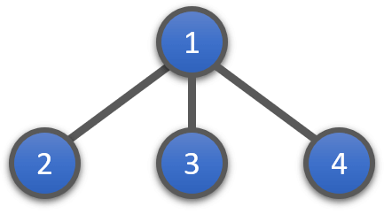

# 题面

已知敌人有 $n$ 个根据地，且根据地与根据地之间有 $m$ 条双向通道使得这 $n$ 个根据地连通。摧毁第 $i$ 条通道需要耗费 $c_i$ 软妹币。然而敌人大大地狡猾，还准备在此基础上再新建一条通道，而我们不知道这条双向通道会连接哪里。我们的软妹币有限，同时只能摧毁已知的通道中的一条。请问最少需要多少预算可以保证不论敌人在哪里建造新通道，我们只炸毁一条已知的通道就可以使得敌人的根据地不再连通？如果做不到，输出 $-1$。

数据范围：

$1 \le n \le 10000$

$1 \le m, c_i \le 100000$

[题目链接](http://acm.hdu.edu.cn/showproblem.php?pid=4005)

# 分析

首先我们来考虑一下无解的情况。

如果本身敌人的根据地就可以构成一条环，那么显然不管炸掉那一条通道都是没有卵用的。由此我们可以首先跑一遍 Tarjan 算法求出图中所有边双连通分量并将它们缩成点，然后得到一棵树。

其次，如果根据地恰好连成一条链（恰好都在一条路径上）也是不行的。因为不论炸掉哪一条通道，敌人一连头尾，照样又联通了。

这告诉我们，如果题目有解，那么**图中一定要存在不在同一条链上的边**。比如下面的这种情形：

更严格地说，就是存在三条边，这三条边对于某一节点都属于不同的子树，那么这三条边就一定不可能在同一条链上。此时，**这三条边中的最大值也就是答案了**。我们只需要让这样的三条边中最长边最短，就得到答案了。

我们可以考虑先选取树中的最短边作为三条边中的一条。我们记这条边的两个端点分别为 $u$ 和 $v$。首先我们把 $u$ 当作 $v$ 的父节点（那么 $v$ 的子树就成了 $u$ 的子树），然后从 $u$ 开始往上 DFS，寻找上面节点中异于当前子树的次小边。同时，我们再把 $v$ 当作 $u$ 的节点执行同样的操作。在所有这些次小边中取最小值，就是最终的答案了。

[完整参考代码](https://github.com/codgician/ACM-ICPC/blob/master/HDUOJ/4005/tarjan_edcc.cpp)

如果对执行过程还不完全理解，可以参考下面的样例。

# 样例

下面给一个样例来更详细地阐述执行过程（取自文末参考博文中的样例）：

首先我们找到最小边 $1 - 8$。

我们先把 $1$ 当成 $8$ 的父亲，那么右边部分就全部成为了 $1$ 的子树。因此我们在左边部分进行 DFS。我们找到节点 $2$ 的次小边 $2 - 5$。由此一来，$1 - 8$、$2 - 4$、$2 - 5$ 就成了对于节点 $2$ 而言分别属于三个不同子树的三条边，同时其中的最长边（长度为 $5$）是左边部分中最小的解。

我们再把 $8$ 当成 $1$ 的父亲，那么左边部分就全部成为了 $8$ 的子树。因此我们在右边部分进行 DFS。我们找到节点 $3$ 的次小边 $3 - 7$。由此一来，$1 - 8$、$3 - 6$、$3 - 7$ 就成了对于节点 $3$ 而言分别属于三个不同子树的三条边，同时其中的最长边（长度为 $7$）是右边部分中最小的解。

取左右最小值，即答案为 $5$。

# %%%

- fangguo - [hdu 4005 边连通度与缩点](https://www.cnblogs.com/wangfang20/p/3244591.html)
- wuyiqi - [hdu 4005 边双联通](https://www.cnblogs.com/wuyiqi/archive/2011/11/04/2235671.html)