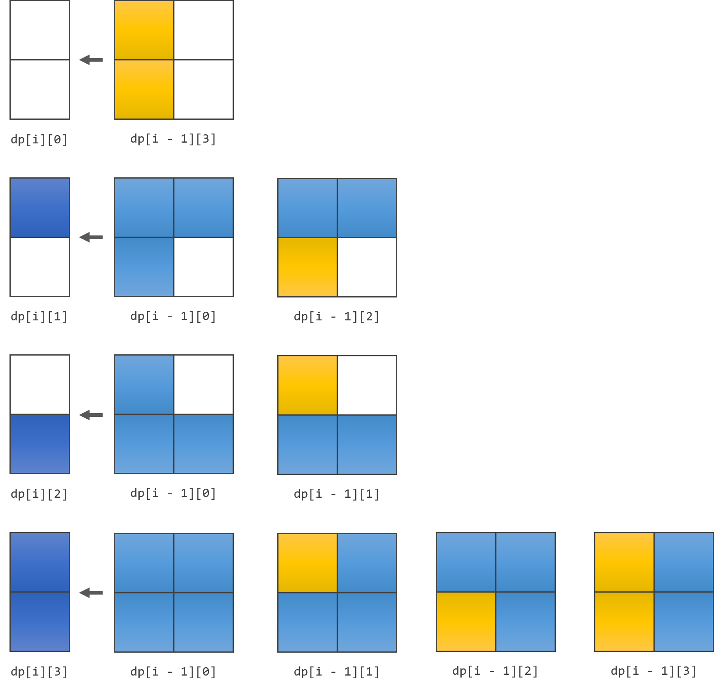

# 题面

对于一个宽度为 $2$ 长度为 $n$ 的棋盘，用 $1 \times 2$ 大小的矩形骨牌和 $3$ 格大小的 $L$ 型骨牌去填充棋牌并使得棋盘被完全覆盖。问方案的个数（对 $10^9 + 7$ 取模）？

**数据范围**：

$1 \le n \le 10^{18}$

[题目链接](http://acm.hrbust.edu.cn/index.php?m=ProblemSet&a=showProblem&problem_id=2372)

# 分析

脚趾头想想都知道多半是动态规划。

我们会很自然的想到，记 $dp[i]$ 为完全覆盖长度为 $i$ 的棋盘所存在的方案数，并思考 $dp[i]$ 如何由之前的状态转移过来。

但是直接这样想是想不出来的（逃

我们来看看 $i = 4$ 时存在的下面这种情况：

显然，这个情况是无法从之前的任何一个合法状态转移过来的。那么显然，这意味着我们光记录合法状态是不够的。

哼，既然光记录合法状态不够，那我就把所有状态都记录下来……

我们不难发现，对于每一列事实上都只有 $4$ 种状态：

那么我们不妨用 $dp[i][s]$ 来表示第 $i$ 列之前均满，第 $i$ 列状态为 $s$，且第 $i$ 列之后均空时的方案个数。

我们可以以此来思考一下每一个 $dp[i][s]$ 可以如何从 $dp[i - 1][t]$ 转移而来：

由上图，我们可以很直观地发现：

$dp[i][0]$ 可以在 $dp[i - 1][3]$ 的基础上什么都不做得来；

$dp[i][1]$ 可以在 $dp[i - 1][0]$ 的基础上加一个 $L$ 型骨牌，或在 $dp[i - 1][2]$ 的基础上横着加一个 $1 \times 2$ 骨牌得来；

$dp[i][2]$ 可以在 $dp[i - 1][0]$ 的基础上加一个 $L$ 型骨牌，或在 $dp[i - 1][1]$ 的基础上横着加一个 $1 \times 2$ 骨牌得来；

$dp[i][3]$ 可以在 $dp[i - 1][0]$ 的基础上横着加两个 $1 \times 2$ 型骨牌，或在 $dp[i - 1][1]$ 的基础上加一个 $L$ 型骨牌， 或在 $dp[i - 1][2]$ 的基础上加一个 $L$ 型骨牌，或在 $dp[i - 1][3]$ 的基础上竖着加一个 $1 \times 2$ 型骨牌得来；

即得出：
$$
\begin{cases}
dp[i][0] = dp[i - 1][3] \\
dp[i][1] = dp[i - 1][0] + dp[i - 1][2] \\
dp[i][2] = dp[i - 1][0] + dp[i - 1][1] \\
dp[i][3] = dp[i - 1][0] + dp[i - 1][1] + dp[i - 1][2] + dp[i - 1][3] \\
\end{cases}
$$
而我们最后要求的答案，也就是 $dp[n][3]$：
$$
ans[n] = dp[n][3]
$$
最后，我们也不难找出边界情况，也就是：
$$
\begin{cases}
dp[1][0] = 1 \\
dp[1][1] = 0 \\
dp[1][2] = 0 \\ 
dp[1][3] = 1 \\
\end{cases}
$$
当然，你也可以简单地记作：
$$
dp[0][3] = 1
$$

---

在此基础上，我们还可以考虑对原转移方程进行化简：
$$
\begin{aligned}
ans[i] &= dp[i][3] \\
&= dp[i - 1][0] + dp[i - 1][1] + dp[i - 1][2] + dp[i - 1][3] \\
&= dp[i - 2][3] + dp[i - 2][0] + dp[i -2][2] +dp[i - 2][0] + dp[i - 2][1] + ans[i - 1] \\
&= (dp[i - 2][0] + dp[i - 2][1] + dp[i - 2][2] + dp[i - 2][3]) + ans[i - 1] + dp[i - 2][0] \\
&= 2 \cdot ans[i - 1] + dp[i - 2][0] \\
&= 2 \cdot ans[i - 1] + dp[i - 3][3] \\
&= 2 \cdot ans[i - 1] + ans[i - 3] \\
\end{aligned}
$$
于是我们由此得到了：
$$
ans[i] = 2 \cdot ans[i - 1] + ans[i - 3]
$$

# 实现

看看题目的数据范围就知道可能要用到矩阵快速幂。这里就略去了。

HRBUST OJ 貌似关闭注册了，懒得写了（逃

反正这道题还是思维最重要，代码写起来也很简单的。

# %%%

呜呜呜怎么大家都会打表找规律啊QAQ 我太辣鸡了。

感谢以下巨佬在本辣鸡弄懂该题过程种给予的帮助：

- zzy
- Hanano
- BinGoo0o0o
- DeaphetS
- jackyan