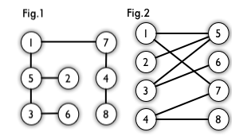
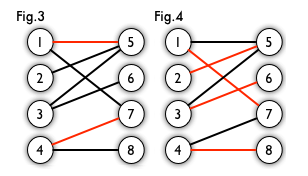
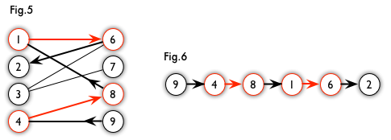
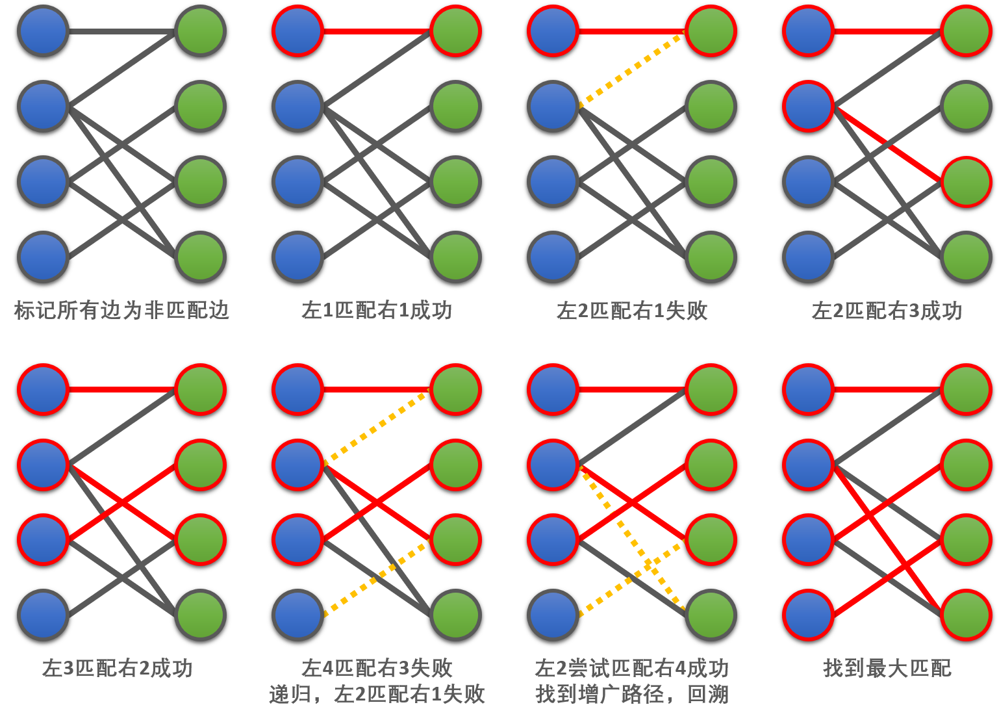
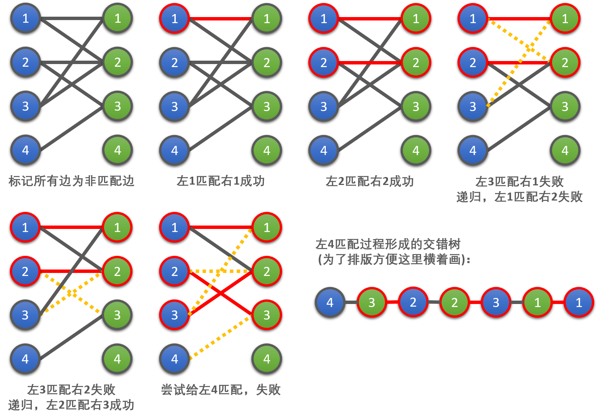

title: 浅谈匈牙利算法
date: 2018-03-09 12:52:01
updated: 2018-08-14 16:32:00
tags: 
- ACM-ICPC
- Graph Theory
- Bipartite Matching
- The Hungarian Algorithm
category: Notes
#mathjax: true

# 前言

国内好像管解决带权二分图最大权匹配问题的算法叫 “KM算法”，不过我到 Wikipedia 上查的时候发现好像这个也可以被称作匈牙利算法，所以在本文中我就姑且管 ”KM算法” 也叫做 “匈牙利算法” 吧。

说好的自己整理笔记，最后却变成了抄别人的博客 + 抄书。我还是太菜了，惭愧😭……

 所以…… 本文**很大程度上**借鉴了巨佬出的新书和网络上几篇优秀文章（具体列表可见文末）。本人向这些文章的作者们表示衷心感谢！


# 几点概念

## 二分图

**二分图 (Bipartite graph)** 是一种特殊的简单图，它的顶点可以被分为两个不相交的集合（$U$ 和 $V$），并且同属一个集合的点两两不相连 ($E_U = E_V = \varnothing$)。也就是说，如果一个图是二分图，它要么没有圈 (cycle)，要么所有圈包含边的个数均为偶数。

例如，下图 `Fig.1` 就是一个二分图。但是为了方便，我们通常将其画作 `Fig.2` 的样子。



那么我们如何使用算法来判定二分图呢？

显然，我们可以使用**染色法**，即用黑白两种颜色来标记图中的节点，当一个节点被标记后，我们将所有与之相邻的节点都标记为相反的颜色。若在此染色过程中出现了冲突，那么就不是二分图，否则是二分图。


## 匹配

**匹配 (Matching)** 是边的集合 ($M \subset E$)，其中任意两条边都没有公共点。

例如，下图 `Fig.3` 中所有红的的边组成的集合就是 `Fig.2` 的一个匹配。而在其中，被标红的边被称作**匹配边**；匹配边所连接的点被称为**匹配点**。与之相反地，没有被标红的边被称作**非匹配边**，非匹配边所连接的点被称作**非匹配点**。

显而易见，对于一个二分图来说，可能会有很多种匹配。如果某二分图的某一个匹配包含的边的数量在该二分图所有匹配中最大，那么称这个匹配为**最大匹配**。例如，下图 `Fig.4` 就是 `Fig.2` 的最大匹配。

相似地，如果这个二分图带权，那么权值之和最大的匹配被称作**最大权匹配**。




## 增广路径

**增广路径 (Augmenting Path)** 是一条连通两个未匹配点，且非匹配边和匹配边在其上交替出现的路径。

例如，下图 `Fig.6` 就是 `Fig.5` 的一条增广路径。



我个人认为增广路径应该理解为**某种还可以进一步优化的路径**，因此在不同的问题中增广路径应该有不同的具体定义。例如上面提到的这种路径，如果把非匹配边和匹配边交换就可以增加一条匹配边（也就是说，这种路径不是最优的，是仍然可以增广的）。

# 无权二分图的最大匹配

## 思想

通过上面的概念，我们不难发现增广路径有一个十分重要的性质：**非匹配边比匹配边多一条**。因此，研究增广路径的意义是**改进匹配**。如果我们把增广路径中的非匹配边和匹配边交换，这样做不仅不会破坏匹配本身的性质（因为增广路径中所有的匹配边并不存在与其他点相连的匹配边），而且交换后匹配边的数目还会比原来多 1 条。

如果我们不停地寻找增广路径，并在每一次找到增广路径后交换增广路径中的匹配点和非匹配点以增加匹配边的数目，这样直到再也找不到增广路径时，我们就得到了该二分图的最大匹配。这就是**匈牙利算法**的本质，因此有时我们也称其为**增广路算法**。


## 流程

1. 设 $S = \varnothing$，即把所有边都标记为未匹配边。
2. 寻找增广路径，接着把其上所有边的状态取反（即把匹配边都标记为未匹配边，未匹配边都标记为匹配边）。
3. 重复第 2 步，直到再也无法在图中找到增广路径。

显然，该算法的关键在于如何寻找增广路径。

匈牙利算法尝试**给每一个左部节点 $x$ 寻找一个右部节点 $y$**。右部节点 $y$ 能够与左部节点 $x$ 匹配，需要满足如下两个条件之一：

1. **$y$ 本身就是非匹配点**。在这种情况下，$x - y$ 本身就是一条非匹配边，则是一条长度为 $1$ 的增广路径。
2. **$y$ 已经与左部点 $x'$ 匹配，但从 $x'$ 出发能找到另一个右部节点 $y'$ 与之匹配**。在这种情况下，$x - y - x' - y'$ 为一条增广路径。

我们可以使用 **深度优先搜素 (DFS)** 来递归地从左部节点 $x$ 出发寻找增广路径。若找到，则在回溯的时候把路径上的匹配状态取反。另外，在每一次搜索时，我们可以开一个 `bool` 数组来记录每个右部节点的访问情况，以避免重复搜索。


## 例子

下面我们举一个例子来演示匈牙利算法的大致过程（请配合图片下方的一段文字说明食用）：



首先，我们从左1出发，找到右1，发现这两点可以匹配（满足条件1）。至此，我们找到了一条增广路径。在回溯时，我们将这条未匹配边标记为匹配边（见图2）。

然后，我们从左2出发，先找到右1，发现它已经与左1匹配了。接着我们递归，尝试给与之匹配的左1另外找一个匹配点。但是我们找不到，因此匹配失败（不满足条件2，见图3）。接着，我们找到右3并匹配成功，找到增广路径，回溯时将该边标记为匹配边（见图4）。

接着，我们从左3出发，找到右2，匹配成功（满足条件1），找到增广路径，回溯时标记该边为匹配边（见图5）。

最后，我们从左4出发，找到右3，发现它已经与左2匹配了。接着我们递归，尝试给与之匹配的左2另外找一个匹配点，我们找到了右4，找到增广路径（满足条件2），回溯并将增广路径上的所有非匹配边标记为匹配边。

至此，我们便找到了最大匹配，算法完成。

另外，插句嘴，对于上例这种所有点最后都成匹配点的匹配，我们称其为**完备匹配**。


## 正确性

匈牙利算法实际上基于**贪心策略**。它的一个重要特点是：当一个节点成为匹配点后，至多因为找到增广路而更换匹配对象，但是**绝对不会从匹配点变成非匹配点**。

如果要更详细（但不够严密）地说明，我们可以从反证法考虑：

假设存在这样的**非最大匹配**，在其中已经无法找到增广路径。

$\because$ 当前匹配不是最大匹配

$\therefore$ 左右部均至少存在一个非匹配点

对于这两个非匹配点，我们可以分两种情况讨论：

- **若这两个点间存在一条边**： 那么我们就找到了一条增广路径，与假设矛盾；
- **若这两个点间不存在边：**
  - **若这两个点可以与已有的匹配点相连**：那么我们完全可以将其加入增广路径里，与假设矛盾；
  - **若这两个点不能与已有匹配点相连**：那么这两个点无法增加图中匹配边的数量，也就是说我们已经找到最大匹配了，与假设矛盾。

## 时间复杂度

对于每个左部节点，寻找增广路最多遍历一次整张二分图，因此该算法的复杂度为 $\mathcal{O}(NM)$。


## 代码 (C++)

**几点说明：**

在代码样例中 $\text{fst}$ 代表左部元素（first 的缩写），$\text{snd}$ 代表右部元素（second 的缩写）。

$\text{arr}$ 是存边的邻接矩阵。例如，$\text{arr}[i][j] == true$ 意味着左部点 $i$ 和右部点 $j$ 间存在一条无权边。

$\text{sndMatch}$ 记录与右部节点相匹配的左部节点（即记录当前的所有匹配边）。例如，$\text{sndMatch}[j] == i$ 意味着左部 $i$ 节点和右部 $j$ 结点间存在一条匹配边。在刚开始时我们将该数组所有元素初始化为 $-1$，代表所有边开始时都是未匹配边。

```cpp
bool arr[SIZE][SIZE], sndVisited[SIZE];
int sndMatch[SIZE];
int fstNum, sndNum;

// Find snd vertex for fst vertex 
bool canFind(int fstId)
{
    for (int i = 0; i < sndNum; i++)
    {
        // If edge exists and snd vertex has not been visited
        if (arr[fstId][i] && !sndVisited[i])
        {
            sndVisited[i] = true;
            
            // Two conditions mentioned above
            if (sndMatch[i] == -1 || canFind(sndMatch[i]))
            {
                sndMatch[i] = fstId;
                return true;
            }
        }
    }
    return false;
}

int hungarian()
{
    int ans = 0; 	// Number of edges in maximum bipartite matching
    for (int i = 0; i < fstNum; i++)
    {
        // Initialize every snd vertex as unvisited
        memset(sndVisited, false, sizeof(sndVisited));
        
        if (canFind(i))
        {
            ans++;
        }
    }
    return ans;
}
```

# 数个名词

## 交错树

在上面提到的算法中，如果从某个左部节点出发寻找匹配失败，那么在 DFS 的过程中，所有**访问过的节点**以及**为了访问这些节点而经过的边**可以构成一棵树。

我们不难发现，这棵树的根是一个左部节点，所有的叶子节点也是左部节点（因为最终匹配失败），并且树上的奇数层边均为非匹配边，偶数层边均为匹配边。因此我们把这棵树称作**交错树**。

为了方便理解，下面简单举个例子：



## 顶标

**顶标，全称顶点标记值**。在二分图中，我们给左部节点一个整数值 $A_i$，给第 $j$ 个右部节点一个整数值 $B_j$。同时，必须满足：
$$
\forall i, j, A_i + B_j \geq w(i, j)
$$


其中，$w(i, j)$ 表示连接 $i, j$ 两点边的权重（如果没有边可设作负无穷）。这些整数 $A_i, B_j$ 称作节点的**顶标**。

## 相等子图

**相等子图**是原图的一个*生成子图*（即包含原图的所有节点，但是不包含所有的边），并且该生成子图中只包含满足下述条件的边：
$$
A_i + B_j = w(i, j)
$$
其中，$A_i$ 是左部 $i$ 点的顶标，$B_j$ 是右部 $j$ 点的顶标，$w(i, j)$ 则是连接 $i, j$ 两点边的权重。

下面我们来看看与之相关的一个定理：

> 若相等子图存在完备匹配，则这个完备匹配就是二分图的最大匹配。

我们简要地证明一下：

在相等子图中，完备匹配的边权之和为：
$$
\sum^{N}_{i = 1}(A_i + B_i)
$$
也就是所有顶标之和。

$\because$ 顶标满足：
$$
\forall i, j, A_i + B_j \geq w(i, j)
$$
$\therefore$ 在整个二分图中，任何一组匹配的边权都不可能大于所有顶标的和。

# 带权二分图的最大权匹配

## 思想

我们不妨先给每个节点随意赋值一个顶标（例如，我们可以赋值 $A_i = max_{i \leq j \leq N} \{ w(i, j) \}, B_j = 0$）。接着，我们采取适当的策略不断扩大相等子图的规模，直至相等子图中存在完备匹配。这样，依据上面的定理，我们便找到了最大权匹配。

## 局限性 

根据上面的思想我们不难发现，**该算法默认了带权最大匹配一定是完备匹配**，因此该算法仅适用于满足“最大匹配一定是完备匹配”的图，而更一般的情况则需要采用费用流来计算最大权匹配。基于此，即使该算法在处理稠密图时有稍高的效率，我们还是建议在遇到相关问题的时候采用费用流。

## 流程

1. 初始化顶标的值： $A_i = max_{i \leq j \leq N} \{ w(i, j) \}, B_j = 0$；
2. 用“无权二分图的最大匹配”中提到的算法寻找相等子图的完备匹配；
3. 若未找到增广路径则采用适当策略修改顶标的值；
4. 重复上述 2、3 直到找到相等子图的完备匹配为止。

至于如何再相等子图中寻找完备匹配，我们可以采用上一节“无权二分图的最大匹配”中提到的算法来寻找该相等子图的最大匹配。如果最大匹配不完备，则说明至少有一个左部节点匹配失败。而节点匹配失败那次所进行的 DFS 并形成了一颗交错树，我们记之为 $T$。

结合寻找最大匹配的过程，不难发现以下结论：

- 除了根节点以外，$T$ 中其它的左部节点都是**从右部点沿着匹配边**访问到的，即在程序中调用了 `canFind(sndMatch[i])`，其中 $i$ 是一个右部节点，`sndMatch[i]` 则是曾与之匹配的左部节点。
- $T$ 中所有右部点都是**从左部点沿着非匹配边**访问到的。

在寻找增广路径以前，我们并不会改变已有的匹配，所以一个右部点沿着匹配边能访问到的左部点是固定的。为了让匹配数增加，我们只能从第 2 条结论入手，考虑**怎样让左部节点沿着非匹配边访问到更多右部点**。

假如我们把交错树 $T$ 中的所有左部节点顶标 $A_i (i \in T)$ 减小一个整数值 $\Delta$，把 $T$ 中所有右部节点顶标 $B_j (j \in T)$ 增大一个整数值 $\Delta$，节点的访问情况会有哪些变化？我们可以分两方面进行讨论：

- **右部点 $j$ 沿着匹配边，递归访问 $i = \text{sndMatch}[j]$ 的情形**。对于一条连接左部点 $i$ 和右部点 $j$ 的匹配边，显然要么 $i, j \in T$（被访问到了），要么 $i, j \notin T$（没被访问到）。因此 $A_i + B_j$ 不变，匹配边仍然属于相等子图。 
- **左部点 $i$ 沿着非匹配边，访问右部点 $j$ 并尝试与之匹配的情形**。由于左部点是被动的（被右部点沿着匹配边递归），因此 $i \in T$。
  - 若 $i, j \in T$ ，显然 $A_i + B_j$ 不变，即以前能从 $i$ 访问到 $j$，现在仍能访问。
  - 若 $i \in T, j \notin T$，则 $A_i + B_j$ 减小。即以前从 $i$ 访问不到 $j$，现在有可能访问到了。

为了保证顶标符合前提条件 $\forall i, j, A_i + B_j \leq w(i, j)$，我们就在所有 $i \in T, j \notin T$ 的边 $(i, j)$ 之中，找出最小的 $A_i + B_j - w(i, j)$ 作为 $\Delta$ 值。只要原图存在完备匹配，这样的边一定存在。上述方法及不会破坏前提条件，又能保证至少有一条新的边会加入相等子图，使得交错树中至少一个左部点能访问到的右部点增多。

至于例子…… 懒得画了，推荐大家参考一下下面提到的那篇博文（逃

## 不好理解？

如果你只对算法过程比较感兴趣而暂时不需要具体理解算法原理，在这里强烈推荐一篇博文：[KM算法详解+模板](http://www.cnblogs.com/wenruo/p/5264235.html)，其中作者用极其新颖而易懂的模型解释了算法的具体流程（其实我最早就是参照这篇博文来学的🙈）。

## 时间复杂度

$\mathcal{O}(N^3)$

## 几点变形

这部分内容是我自己在做题的 YY 出来的，如果错误恳请指正。

1. 如果要求最小权匹配，可以直接把边权去成负数，得出答案后再取绝对值。
2. 对于部分找不到结果要求输出 -1 的题目，为了避免死循环，当执行 “在所有 $i \in T, j \notin T$ 的边 $(i, j)$ 之中找出最小的 $A_i + B_j - w(i, j)$”  时，如果发现找不到，就说明没有满足要求的结果，这个时候就可以直接 `return -1;` 了。
3. 【正确性未知】对于不满足“带权最大匹配一定是完备匹配”这一特性的图，我们可以将不存在的边都当作边权为 -INF 的边（这样就可以保证一定可以找出最大权完备匹配），然后我们再在计算最大权的时候剔除长为 -INF 的边，这样剩下的匹配应该就是最大权匹配。

## 代码 (C++)

**几点说明：**

在代码样例中 $\text{fst}$ 代表左部元素（first 的缩写），$\text{snd}$ 代表右部元素（second 的缩写）。

$\text{arr}$ 是描存边的邻接矩阵。例如，$\text{arr}[i][j] = k$ 代表左部点 $i$ 与右部点 $j$ 之前存在一条权重为 $k$ 的边。至于不存在的边，我们令 $\text{arr}[i][j] = -\infty$。

$\text{fstEx}$ 和 $\text{sndEx}$ 则分别记录了左部何右部每个点的顶标值。

$\text{sndMatch}$ 记录与右部节点相匹配的左部节点（即记录当前的所有匹配边）。例如，$\text{sndMatch}[j] == i$ 意味着左部 $i$ 节点和右部 $j$ 结点间存在一条匹配边。在刚开始时我们将该数组所有元素初始化为 $-1$，代表所有边开始时都是未匹配边。

$\text{sndNeed}$ 则是记录当前寻找最大匹配过程中每一次找到找到满足 $i \in T, j \notin T$ 的边 $(i, j)$ 时的 $\Delta$ 值： $A_i + B_j - w(i, j)$。这个数组会在寻找最小 $\Delta$ 值的时候用到。

## DFS 版本

注：DFS 版本最坏时间复杂度可能高达 $\mathcal{O}(N^4)$，所以一般建议使用下文中的 BFS 版本（该结论引用自：[【原创】KM算法的Bfs写法](https://blog.csdn.net/c20182030/article/details/73330556)）。

```cpp
int arr[SIZE][SIZE];
int fstEx[SIZE], sndEx[SIZE];
int sndMatch[SIZE], sndNeed[SIZE];
bool fstVisited[SIZE], sndVisited[SIZE];
int sndNum, fstNum;

bool canFind(int fstId)
{
    fstVisited[fstId] = true;
    for (int i = 0; i < sndNum; i++)
    {
        if (sndVisited[i])
            continue;

        int delta = fstEx[fstId] + sndEx[i] - arr[fstId][i];
        if (delta == 0)
        {
            sndVisited[i] = true;
            if (sndMatch[i] == -1 || canFind(sndMatch[i]))
            {
                sndMatch[i] = fstId;
                return true;
            }
        }
        else
        {
            sndNeed[i] = min(sndNeed[i], delta);
        }
    }
    return false;
}

int hungarian()
{
    memset(sndMatch, -1, sizeof(sndMatch));
    memset(sndEx, 0, sizeof(sndEx));

    for (int i = 0; i < fstNum; i++)
    {
        fstEx[i] = arr[i][0];
        for (int j = 1; j < sndNum; j++)
        {
            fstEx[i] = max(fstEx[i], arr[i][j]);
        }
    }

    for (int i = 0; i < fstNum; i++)
    {
        for (int j = 0; j < sndNum; j++)
        {
            sndNeed[j] = INF;
        }

        while (true)
        {
            memset(fstVisited, false, sizeof(fstVisited));
            memset(sndVisited, false, sizeof(sndVisited));

            if (canFind(i))
                break;

            int minDelta = INF;
            for (int j = 0; j < sndNum; j++)
            {
                if (!sndVisited[j])
                    minDelta = min(minDelta, sndNeed[j]);
            }

            for (int j = 0; j < fstNum; j++)
            {
                if (fstVisited[j])
                    fstEx[j] -= minDelta;
            }
            for (int j = 0; j < sndNum; j++)
            {
                if (sndVisited[j])
                    sndEx[j] += minDelta;
                else
                    sndNeed[j] -= minDelta;
            }
        }
    }

    int ans = 0;
    for (int i = 0; i < sndNum; i++)
    {
        ans += arr[sndMatch[i]][i];
    }
    return ans;
}
```

## BFS 版本

```cpp
int arr[SIZE][SIZE];
int fstEx[SIZE], sndEx[SIZE];
int sndMatch[SIZE], sndNeed[SIZE], pre[SIZE];
bool sndVisited[SIZE];
int sndNum, fstNum;

void bfs(int fstId)
{
    for (int i = 0; i < sndNum; i++)
    {
        sndVisited[i] = false;
        sndNeed[i] = INT_MAX;
        pre[i] = -1;
    }

    int cntSnd = -1;
    while (cntSnd == -1 || sndMatch[cntSnd] != -1)
    {
        int cntFst;
        if (cntSnd == -1)
            cntFst = fstId;
        else
        {
            cntFst = sndMatch[cntSnd];
            sndVisited[cntSnd] = true;
        }

        int minDelta = INT_MAX;
        int minSnd = -1;
        for (int i = 0; i < sndNum; i++)
        {
            if (!sndVisited[i])
            {
                if (sndNeed[i] > fstEx[cntFst] + sndEx[i] - arr[cntFst][i])
                {
                    sndNeed[i] = fstEx[cntFst] + sndEx[i] - arr[cntFst][i];
                    pre[i] = cntSnd;
                }

                if (sndNeed[i] < minDelta)
                {
                    minDelta = sndNeed[i];
                    minSnd = i;
                }
            }
        }

        fstEx[fstId] -= minDelta;
        for (int i = 0; i < sndNum; i++)
        {
            if (sndVisited[i])
            {
                fstEx[sndMatch[i]] -= minDelta;
                sndEx[i] += minDelta;
            }
            else
                sndNeed[i] -= minDelta;
        }

        cntSnd = minSnd;
    }

    while (cntSnd != -1)
    {
        if (pre[cntSnd] == -1)
            sndMatch[cntSnd] = fstId;
        else
            sndMatch[cntSnd] = sndMatch[pre[cntSnd]];
        cntSnd = pre[cntSnd];
    }
}

int hungarian()
{
    for (int i = 0; i < sndNum; i++)
    {
        sndMatch[i] = -1;
        sndEx[i] = 0;
    }

    for (int i = 0; i < fstNum; i++)
    {
        fstEx[i] = arr[i][0];
        for (int j = 1; j < sndNum; j++)
        {
            fstEx[i] = max(fstEx[i], arr[i][j]);
        }
    }

    for (int i = 0; i < sndNum; i++)
    {
        bfs(i);
    }

    int ans = 0;
    for (int i = 0; i < sndNum; i++)
    {
        if (sndMatch[i] != -1)
            ans += arr[sndMatch[i]][i];
    }
    return ans;
}
```

# 后语

这篇文章算得上是我第一次写稍微有点难度的算法总结文章…… 可能会有很多错误，欢迎指正~

本文后续可能还会有几次更新。

# 参考文献

- 李煜东 - 《算法竞赛进阶指南》
- Renfei Song - [二分图的最大匹配、完美匹配和匈牙利算法](https://www.renfei.org/blog/bipartite-matching.html)
- liam0205 - [二分图最大匹配问题与匈牙利算法的核心思想](https://liam0205.me/2016/04/03/Hungarian-algorithm-in-the-maximum-matching-problem-of-bigraph/)
- Dark_Scope - [趣写算法系列之--匈牙利算法](http://blog.csdn.net/dark_scope/article/details/8880547)
- SixDayCoder - [二分图的最佳完美匹配——KM算法](http://blog.csdn.net/sixdaycoder/article/details/47720471)
- 伊甸一点 - [我的KM算法详解](https://www.cnblogs.com/zpfbuaa/p/7218607.html)
- 段文弱 - [KM算法详解+模板](http://www.cnblogs.com/wenruo/p/5264235.html)
- C20182030EPIC - [【原创】KM算法的Bfs写法](https://blog.csdn.net/c20182030/article/details/73330556)