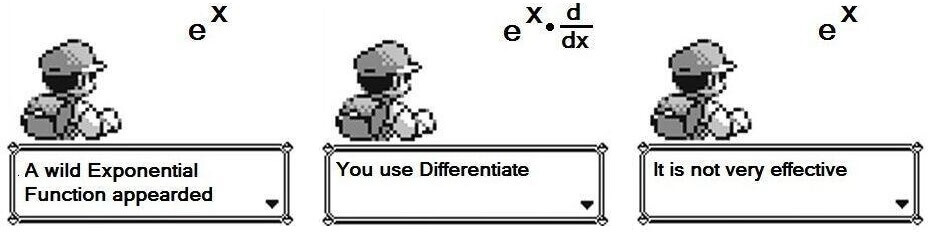

# 简介

在进入正题前总是忍不住想先扯点其它的……

前几周经不住诱惑购入了蔡小雄先生所著的数本高中数学相关的书籍，其中《更高更妙的高中数学 一题多解与一题多变》卷首语中的一段文字让我感触颇多：

> 在实际教学中，我们会遇到这样的情况：有的题不是考察学生**认知障碍**，而是考查学生的“合理”错误；有的题不是让学生**把握数学的本质、方法、思想和理性精神**，而是教学生去防陷阱、防小人、防“边界”；有的题不是教学生**大胆地去创新、探究**，而是引导学生去“循规蹈矩”，找题型、找原型、找关系、找技巧。这样的题做多了，**人会变笨，会更讨厌数学**。

而我个人的经历有何尝不与之相似？在高三上期与《高考数学你真的掌握了吗？》系列丛书邂逅前，我也因“循规蹈矩”而迷失于题海之中。在我眼中，有的只是繁琐的计算，枯燥的数字和无法捉摸的套路。当你秉承“暴力解决一切”的思想去面对数学时，数学诸多优美之处便荡然无存。

近几年来我们可以看到高考也越来越侧重于考察素质与能力：其不仅仅包含着对基本知识的概念与理解，更有一种**乐于探究，勇于创新的精神**。这种精神驱动着我们不仅仅满足于解出一道题，而是从不同的角度去思考，用不同的方法去探究，以在快乐与满足之中提升我们**类比迁移、化繁为简、数形结合、归纳猜想等等数学素养**。或许若干年后我们并不从事数学相关的职业，也早已忘记什么韦达定理、什么圆锥曲线第二定义... 但长存于心的一定将是迁移问题的思想和解决问题的能力。而有这，我想数学教育也就成功了。

而能具体地体现数学之美的也便是众多“不走寻常路”的方法了。比如，在解圆锥曲线题目时你或许会不假思索地用直角坐标系去解答，但你有想过参数方程或许可以更简便地得出答案吗？在做恒成立问题时你会不假思索地立马进行求导讨论，可你有想过对原函数做适当变换其实可以事半功倍吗？有时我想，高考或许没有错，**是我们学习与应考的方式给高考打上了机械化、不合理的标签**。若平时静下心来，花一些时间对做过的一些题去探究、去总结、去尝试、去创新，便会发现难题不就是由一些奇巧的思想组合而来的吗？

作为一名高三学生，我很遗憾直到中学的最后阶段才得以粗浅地领略数学的美妙。在此，我也想小小地分享一下曾激起我学习数学兴趣的几点有关导数压轴题的特殊技巧。之前本来打算把优化函数以方便求解、对端点效应的优化以及浅谈洛必达法则三点心得写在一篇名为“奇技淫巧”的博文里的，结果发现还没写完文章就长地令人难以忍受。于是我觉得把这一篇文章拆为三篇文章可能会和谐一些。

这三篇文章里都会有几道相同的例题出现（即2010年和2011年全国大纲卷的两道导数压轴题）。希望读者有兴趣的话可以把这三篇文章摆在一起看，感受一下运用不同方法带来的不同乐趣。

# 真·简介

好吧，这回是真的简介了（逃...

在做导数相关的题目时，我们往往习惯于一来就先分离参数或者直接求导再考虑下一步怎么做。殊不知，很多时候先静下心来，仔细观察一下原函数并对函数做出适当变换（优化）其实可以事半功倍。

为了方便陈述，个人将这种方法（思路）命名为“优化法”。该方法也来自于《高考数学你真的掌握了吗》系列丛书的《函数》一册。

# 指数型 ($e^x$)

$e^x$在导数题中的出镜率不可谓不低，而其最显著的特点便是：

就像上图那样，倘若对于含$e^x$的函数直接求导，其导函数也会带有$e^x$。在较为简单的函数中（比如形如$f(x) = e^{ax + b} + cx + d$），直接求导仍能比较方便地找到导函数的零点以讨论单调区间。然而对于稍微复杂的函数，$e^x$的存在便直接增大了我们寻找导函数零点的难度。

还好，我们不难发现，对于形如$f(x) = g(x)e^x + m$的函数，其导函数为$f'(x) = e^x[g'(x) + g(x)]$。类似地，如果是形如$f(x) = g(x)e^{-x} + m$的函数，其导函数为$f'(x) = e^{-x}[g'(x) - g(x)]$。我们知道$e^x > 0 (x \in R)$，那么实际上在讨论$f(x)$的单调性时，我们仅仅需要讨论$\phi(x) = g'(x) + g(x)$或是$\phi(x) = g'(x) - g(x)$的正负性即可，也便有效地解决了无法解得零点的问题。

**因此，对于含$e^x$的函数，我们应考虑将函数化为$e^xg(x) + b$或$e^{-x}g(x) + b$的形式。**

---

2010年全国大纲卷理科数学的压轴题是一道难题，并且此题在高考中坑完了一批无辜的学生还变着花样在模拟题中坑更多的学生，乃至于在不久前我甚至做到一道与该题几乎没有区别的2016武汉模拟题。在各大资料都倾向于使用令高中生头疼的放缩法亦或是普通高中生听都没听说过的洛必达法则（后文中也会介绍）解答时，我们来看看它与上述技巧能碰撞出怎样的火花：

**1.** (2010.全国大纲卷理) 设函数$f(x) = 1 - e^{-x}$.  
(1) 证明：当$x > -1$时，$f(x) \ge \frac{x}{x+1}$；  
(2) 设当$x \ge 0$时，$f(x) \le \frac{x}{ax + 1}$，求$a$的取值范围.

*注：由于(1)问较简单，这里只分析第(2)问。*

**解:**  (2)  
$$\begin{aligned}
& f(x) \le \frac{x}{ax + 1} \\
& \Leftrightarrow 1 - e^{-x} \le \frac{x}{ax + 1} \\
& \Leftrightarrow 1 - \frac{x}{ax + 1} \le e^{-x} \\
& \Leftrightarrow e^x(1 - \frac{x}{ax + 1}) \le 1
\end{aligned}$$

令：
$$F(x) = e^x(1 - \frac{x}{ax + 1}) - 1$$
即证$x \ge 0$时$F(x) \le 0$恒成立  
$$\begin{aligned}
\therefore F'(x) & = e^x[1 - \frac{x}{ax + 1} - \frac{(ax - 1) - ax}{(ax + 1)^2}] \\
                 & = \frac{e^x}{(ax + 1)^2}[(a^2 - a)x^2 + (2a - 1)x] \\
                 & = \frac{xe^x}{(ax + 1)^2}[(a^2 - a)x + (2a - 1)]
\end{aligned}$$

*插一句话：这个时候我们就要分情况讨论了。注意到$(a^2 - a)x + (2a - 1)$在$a \neq 0 \ or \ \pm1$时是一次函数，所以不妨以$a^2 - a = 0$与$2a - 1 = 0$所解得的a值作为临界来讨论。另外，显然$a < 0$可以放在一起讨论（第1问起了提示作用）。*

**I.** 若$a < 0$  
$\therefore$ 当$x \in (-\frac{1}{a},+\infty)$时：
$$\frac{x}{ax + 1} < 0$$
又$\because$ 在$x \in [0,+\infty)$时：
$$f(x) = 1 - e^{-x} \ge 0$$
$\therefore$ 当$x \in (-\frac{1}{a},+\infty)$时：
$$f(x) > \frac{x}{ax + 1}$$
与题意矛盾，舍去.  

**II.** 若$a \in [0,\frac{1}{2}]$，有： 
$$\begin{cases}
a^2 - a \le 0 \\
2a - 1 \le 0
\end{cases}$$
由一次函数性质，$x \in [0,+\infty)$时：
$$(a^2 - a)x + (2a - 1) \le 0$$
$$\therefore F'(x) \le 0$$
$\therefore F(x)$在$[0,+\infty)$单调递减 ，故： 
$$\therefore F(x) \le F(0) = 0$$
满足题意.

**III.** 若$a \in (\frac{1}{2}, 1)$，有：
$$\begin{cases}
a^2 - a \le 0 \\
2a - 1 > 0
\end{cases}$$ 
令$f'(x) = 0$，有：
$$x = \frac{1 - 2a}{a^2 - a} > 0$$
$\therefore F(x)$在$[0, \frac{1 - 2a}{a^2 - a}]$上单调递增，故：  
$$F(\frac{1 - 2a}{a^2 - a}) > F(0) = 0$$
不满题意，舍去。

**IV.** 若$a \ge 1$  
$$\begin{cases}
a^2 - a \ge 0 \\
2a - 1 \ge 0
\end{cases}$$
由一次函数性质，$x \in [0,+\infty)$时：
$$(a^2 - a)x + (2a - 1) > 0$$
$$\therefore F'(x) > 0$$
$\therefore F(x)$在在$[0,+\infty)$单调递增，故：  
$$ F(x) \ge F(0) = 0$$
不满题意，舍去。

综上，$a \in [0,\frac{1}{2}]$

答：a的取值范围为$[0,\frac{1}{2}]$。

怎么样，是不是很简单？别看情况分的挺多，其实每一种情况几乎就是几秒就可以判断出是否满足条件。

再来看看[参考答案](http://www.jyeoo.com/math2/ques/detail/3e6ca929-5ca7-4716-a80c-1873e641d558)，它利用了$e^x \ge x + 1$这一基本放缩，而且思路极其不好想，远没有该方法好想、易操作。

# 对数型 ($lnx$)

与上一节相似地，我们不难发现，对于形如$f(x) = lng(x)$的函数，其导函数为$f'(x) = \frac{g'(x)}{g(x)}$，也可以使其导函数中不再带有对数函数从而更易讨论解答。

**因此，对于含$h(x)lng(x)$的函数，我们应考虑把函数化为$k(x) + lng(x)$的形式。**

2011年全国大纲卷理科数学的压轴题也是一道有名的难题，让我们来看看优化函数又能起到怎样的效果。

**2.** (2011.全国大纲卷理) 已知函数$f(x) = \frac{alnx}{x+1} + \frac{b}{x}$，曲线$y = f(x)$在点$(1, f(1))$处的切线方程为$x + 2y - 3 = 0$.  
(1) 求a,b的值;  
(2) 如果当$x > 0$，且$x \neq 0$时，$f(x) > \frac{lnx}{x - 1} + \frac{k}{x}$，求$k$的取值范围.  

*注：(1)问过程略，解得 a = 1，b = 1，这里只分析第(2)问。*

**解: ** (2)  
由题，有：
$$\frac{lnx}{x + 1} + \frac{1}{x} > \frac{lnx}{x - 1} + \frac{k}{x}$$
$$\Leftrightarrow \begin{cases}
(k - 1)(x - \frac{1}{x}) + 2lnx < 0 & (x > 1) \\
(k - 1)(x - \frac{1}{x}) + 2lnx > 0 & (0 < x < 1)
\end{cases}$$

令：
$$g(x) = (k - 1)(x - \frac{1}{x}) + 2lnx$$
$\therefore 0 < x < 1$时，$g(x) > 0$；$x > 1$时，$g(x) < 0$
$$g'(x) = \frac{(k - 1)x^2 + 2x + k - 1}{x^2}$$

令：
$$h(x) = (k - 1)x^2 + 2x + k - 1$$

**I.** 若 $k \le 0$  
对$h(x)$：
$$\Delta = 4 - 4(k - 1)^2 \le 0$$
由二次函数性质：
$$h(x) \le 0$$
$$\therefore g'(x) \le 0$$
$\therefore g(x)$在$(0,1)$和$(1,+\infty)$单调递减  
$\therefore$ 在$(0,1)$上，$g(x) > g(1) = 0$恒成立；在$(1,+\infty)$上，$g(x) < g(1) = 0$恒成立  
$\therefore$ 满足要求

**II.** 若 $0 < k < 1$  
对$h(x)$：
$$\Delta = 4 - 4(k - 1)^2 > 0$$
设$h(x)$两零点分别为$x_1$、$x_2$，且$x_2 > x_1$  
由韦达定理：
$$x_1 + x_2 = -\frac{2}{k - 1} > 2$$
$$\therefore x_2 > 1$$
$\therefore$ 由二次函数性质，当$x \in (1, x_2)$时有：
$$g(x) > 0$$
$\therefore$ 不符要求，舍去.

**III.** 若 $k \ge 1$  
$$\therefore k - 1 \ge 0$$
又$\because$ 在$(1,+\infty)$区间内$x$单调递增，$\frac{1}{x}$单调递减  
$\therefore x - \frac{1}{x}$在该区间内单调递增  
$$\therefore x - \frac{1}{x} > 1 - \frac{1}{1} = 0$$
$\therefore$ 在$(1,+\infty)$区间内：
$$g(x) = (k - 1)(x - \frac{1}{x}) + 2lnx > 0$$
$\therefore$ 不符要求，舍去.

$\therefore$ 综上，$k \in (-\infty,0]$

答: $k$的取值范围为$(-\infty,0]$。

该题的解法可谓十分巧妙。就算优化函数的过程中会出现不可避免的分类讨论，但在不同情况下优化后新函数的方程式都是一样的。自然而然我们便知道了新函数在不同区间内的正负性。我们只需对新函数求导并讨论即可。

有读者可能会问：我怎么知道要讨论$k$的哪些区间？其实在本题中$k$的区间是由$\Delta$的正负性和二次项系数的正负性决定的。也就是说，我们基本上就是在讨论$h(x)$是否有解和开口方向不同的几种可能情况。

上述方法与该题的[参考答案](http://www.mofangge.com/html/qDetail/02/g3/201108/7oeag302255882.html)是十分类似的，感兴趣的话也可以去看看。

# 既有对数又有指数？

额... 一般来说对于既有对数又有指数的题目**一般不采用该方法**，因为就算进行优化也只能顾全一者，优化后的式子往往也不够简单。但再少见的较为简单的情况中，我们只需要顾及其中一种就是了。

前几天的一次数学周考中，有如下一道导数压轴题，我也在此把它当作一道例题：  

**3**. (2016.武汉模拟) 已知函数$f(x) = e^x - ax^2$，曲线$y = f(x)$在$x = 1$处的切线方程为$y = bx + 1$.  
(1) 求a,b的值；  
(2) 求函数$f(x)$在$[0,1]$上的最大值；  
(3) 证明：当$x > 0$时，$e^x + (1 - e)x - xlnx -1 \ge 0$.  

前两问实属容易，这里就不讲解了，公布一下答案：  
(1) $a = 1; b = e - 2$  
(2) 最大值即$f(1) = e - 1$  

好的，接下来我们重点看看(3)问。我们先对待求的这个不等式进行观察，发现其中有一项$xlnx$。这非常令人不爽，因为我们知道对$xlnx$求导函数的结果是$lnx + 1$，并不能搞掉$lnx$；而如果是对$lnx$求导函数结果即$\frac{1}{x}$，就根本没有对数的事情了。再看看题目，限制条件为$x > 0$，于是本着简化原式的思想我将不等号两边除以$x$。

这样一来，我们就将原题转化为证明$\frac{e^x}{x} + (1 - e) - lnx - \frac{1}{x} \ge 0$在$x > 0$时恒成立了。  

令：
$$F(x) = \frac{e^x}{x} + (1 - e) - lnx - \frac{1}{x}$$
$$\begin{aligned}
\therefore F'(x) & = \frac{xe^x - (e^x - 1)}{x^2} - \frac{1}{x} \\
                 & = \frac{(x - 1)e^x - (x - 1)}{x^2} \\
                 & = \frac{(x - 1)(e^x - 1)}{x^2}
\end{aligned}$$

令$F'(x) = 0$，得$x = 1$.  
当$x \in (0,1)$时，$F'(x) < 0$，$F(x)$单调递减；  
当$x \in (1,+\infty)$时，$F'(x) > 0$，$F(x)$单调递增；  
$\therefore F(1)$为$F(x)$的极小值点  
$$\therefore F(x) \ge F(1) = 0$$
$$\therefore xF(x) \ge 0$$
$\therefore$ 得证

卧槽！怎么会这么简单？这简直是我做过最简单的一道导数压轴题了... 当时考试时我还觉得不可能这么简单还重算了2遍，最后发现真的这么简单...直到我看到了[参考答案](http://www.jyeoo.com/math2/ques/detail/bc86d470-f229-43d4-a98a-791409411aaa)。

参考答案我就不转载了，大家点上面的链接进去看看吧。参考答案的解法利用了一个基本的放缩式$lnx \le x - 1$（可以自行求导证明），从而将$xlnx$搞掉：$xlnx \le x^2 - x$。这样的好处是不仅仅搞掉了$xlnx$，同时还获得了$x^2$，可以构造出题目中的$f(x)$。由$e^x + (1 - e)x - xlnx -1 \ge e^x + (1 - e)x - (x^2 - x) -1$，自然而然地问题也就转化为证明$e^x + (1 - e)x - (x^2 - x) -1 \ge 0$，即$f(x) \ge (e - 2)x + 1$。这样以来就转化为了$f(x) \ge g(x)$这一类的问题了，直接令$h(x) = f(x) - g(x)$求导做就行了。 然而，这种消去$xlnx$的方法远没有两边直接除以$x$的方法优雅高效，同时尤其是对于初学者也不是很好想。

# 小结

本文简要介绍了对于含有$e^x$或含有$lnx$的函数先进行适当变换再进行求解的方法，这种方法往往可以轻松地解决相应题目。

- 对于含$e^x$的函数，我们应考虑将函数化为$e^xg(x) + b$或$e^{-x}g(x) + b$的形式。
- 对于含$h(x)lng(x)$的函数，我们应考虑把函数化为$k(x) + lng(x)$的形式。
- 对于两者都有的函数，一般不这样考虑，但在简单的情况下顾全一者即可求出。

文章遵循[CC BY-NC-SA 4.0](http://creativecommons.org/licenses/by-nc-sa/4.0/)协议。

# 参考文献
1. 张杨文主编.高考数学你真的掌握了吗 函数 [M].北京：清华大学出版社, 2014 (2016.5 重印)
